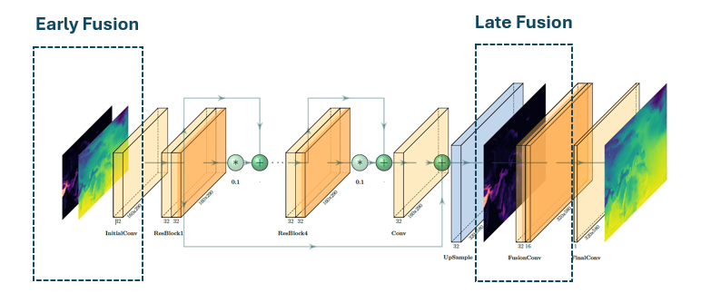
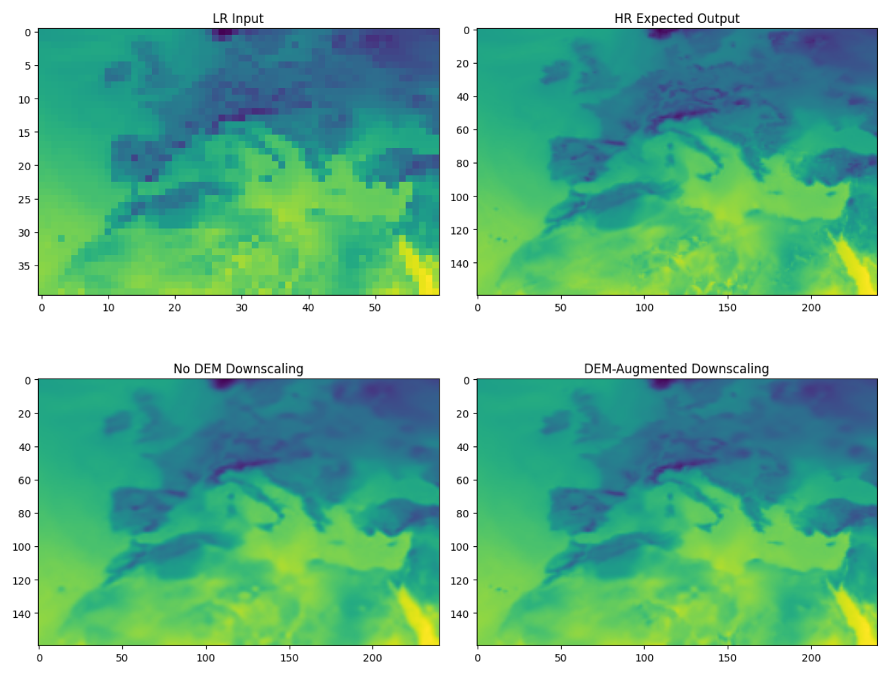
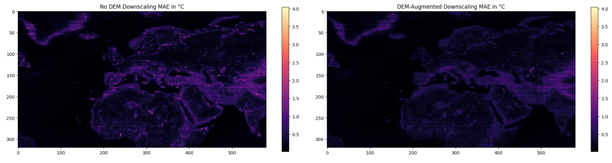

# Use of Deep Learning methods and land cover/use data to improve the spatial resolution of Numerical Weather Prediction (NWP) simulations

    <b>MSc in Data Science</b>  
    NCSR Demokritos and University of Peloponnese  
    <b>Thesis Code</b>  
    October 2025

The aim of this thesis is to implement a method based on Deep Learning techniques to improve the spatial resolution of the results obtained from numerical weather prediction models. Specifically, the study focuses on air temperatures 2 meters (T2m) above sea level.

## 🗺️ Dataset

The ground truth data used for training the DL models comes from the **ERA5 reanalysis dataset**[^1], available in the Copernicus Climate Data Store.

- <b>Variable</b>: 2-meter air temperature (T2m)
- <b>Period</b>: 2000 – 2020
- <b>Temporal resolution</b>: 6-hourly (00:00, 06:00, 12:00, 18:00 UTC)
- <b>Spatial domain</b>: Latitude 80° N to 0°, Longitude 60° W to 85° E

## ⚙️ Preprocessing

To create a controlled downscaling problem, the native 0.25° data were upscaled to 0.5° and 1°, and the models were then tasked with gradually reconstructing the original high-resolution data.
 

So, the preprocessing included the following steps:

1. <b>Upscaling</b>: Bicubic interpolation to match target resolution (from 0.25° x 0.25° to 0.5° x 0.5° and 1° x 1°)
2. <b>Normalization</b>: Z-score standardization
3. <b>Shuffling</b>: Randomize data order to remove temporal bias
4. <b>Splitting</b>: 70% training, 15% validation, 15% testing

## 🤖 Model Architecture

The downscaling task was formulated as a <b>Single Image Super-Resolution</b> problem, and four network architectures were evaluated, with <b>EDSR</b> emerging as the best-performing model.

1. Convolutional Auto-Encoder (CAE)
   

      
   

2. Super-Resolution Convolutional Neural Network (SRCNN)
   

      
   

3. Enhanced Deep Super-Resolution Network (EDSR)
   

      
   

4. Residual Channel Attention Network (RCAN)
   

      
   

## 🏔️ Elevation Integration Strategies

Two main elevation integration strategies were tested:

- <b>Early Fusion</b>: elevation data is concatenated with the low-resolution temperature input at the initial stage

- <b>Late Fusion</b>: elevation data is introduced later in the network, closer to the output layer

In addition, a combination of these two approaches was also explored.

  

## 📊 Results

First, four different model architectures were compared, and the best-performing one — <b>EDSR</b> — was selected for the subsequent steps of the study. Next, the development of <b>seasonal models</b> was tested to determine whether they could improve T2m downscaling performance. However, results showed that a <b>single universal model</b> performed better overall, likely because the spatial domain is large and seasonal patterns vary across the region.

Finally, different <b>elevation integration strategies</b> were evaluated, and the <b>combination of early and late fusion</b> produced the best results. The following image illustrates the difference between <b>no-DEM-aware</b> and <b>DEM-aware</b> downscaling, showing clear improvements in challenging areas with complex terrain.

  

To summarize the results visually, these maps display the MAE across the entire domain for both the <b>non-DEM-aware</b> model and the best <b>DEM-augmented</b> model. Errors are notably higher in regions with complex terrain, such as mountainous and coastal areas, but incorporating elevation data clearly improves the performance of the downscaling method.

  

[^1]: [ERA5 hourly data on single levels from 1940 to present](https://doi.org/10.24381/cds.adbb2d47)
