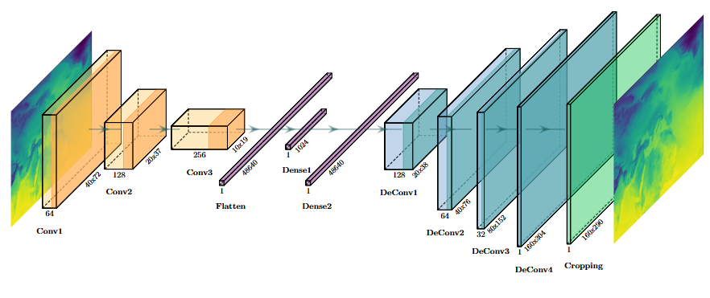
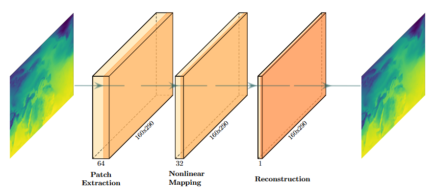
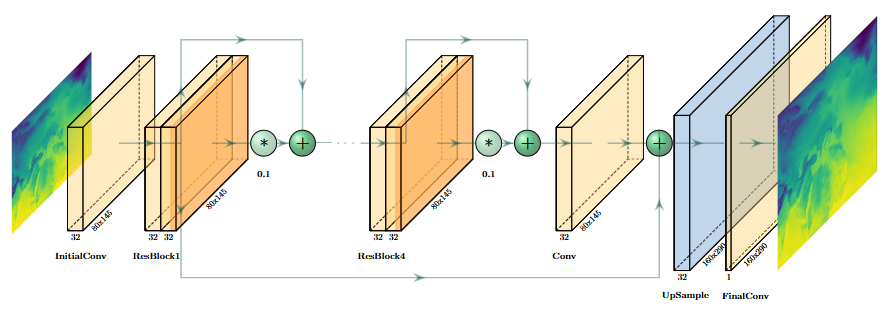
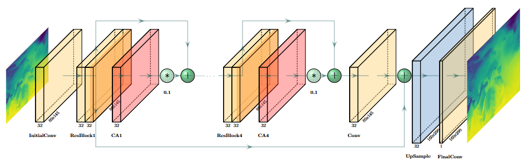

# Use of Deep Learning methods and land cover/use data to improve the spatial resolution of Numerical Weather Prediction (NWP) simulations

    <b>MSc in Data Science</b>  
    NCSR Demokritos and University of Peloponnese  
    <b>Thesis Code</b>  
    October 2025

The aim of this thesis is to implement a method based on Deep Learning techniques to improve the spatial resolution of the results obtained from numerical weather prediction models. Specifically, the study focuses on air temperatures 2 meters (T2m) above sea level.

## 🗺️ Dataset

The ground truth data used for training the DL models comes from the **ERA5 reanalysis dataset**[^1], available in the Copernicus Climate Data Store.

- <b>Variable</b>: 2-meter air temperature (T2m)
- <b>Period</b>: 2000 – 2020
- <b>Temporal resolution</b>: 6-hourly (00:00, 06:00, 12:00, 18:00 UTC)
- <b>Spatial domain</b>: Latitude 80° N to 0°, Longitude 60° W to 85° E

## 🤖 Model Architecture

The downscaling task was formulated as a <b>Single Image Super-Resolution</b> problem, and four network architectures were evaluated, with <b>EDSR</b> emerging as the best-performing model.

1. Convolutional Auto-Encoder (CAE)
   
2. Super-Resolution Convolutional Neural Network (SRCNN)
   

      
   

3. Enhanced Deep Super-Resolution Network (EDSR)
   
4. Residual Channel Attention Network (RCAN)
   

## 📊 Final Results

### 📌 Notes

- All models were implemented using **Scikit-learn** and **TensorFlow/Keras**.
- Visualizations were created using **Matplotlib** and **Seaborn**.

[^1]: [ERA5 hourly data on single levels from 1940 to present](https://doi.org/10.24381/cds.adbb2d47)
